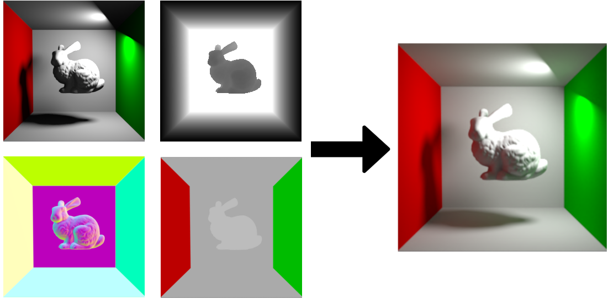

# GAN Illumination

The code used for my Master's thesis.

## Introduction

In computer graphics, real-time rendering with a global illumination model is still a challenge. Rendering with a global illumination model makes the render look more realistic, as effects such as light reflection and refraction can be added. We implemented and trained a generative adversarial neural network to enrich an image of a 3D scene rendered with a global illumination model based on an image of a 3D scene rendered with a local illumination model and additional scene information, which can already be quickly computed when using the local illumination model. A properly designed and trained neural network can give us results comparable to classical global illumination model rendering methods, such as path tracing, on the scenes used in the learning phase. Above all, this approach can be faster and could therefore be used for real-time applications.

## How it works

The neural network learns indirect illumination effects, such as light reflection, from the provided dataset. For training, we provide the network with images with direct illumination and G-buffers, as well as images with indirect illumination, which serve as the ground truth.

The network works by the principle of *"one network per scene"*, which means that we have to train a new neural network for each scene with a distinct artistic style. For example, two video games are visually and artistically different from each other, so we have to train a neural network for each of them.

Once the network is properly trained, it can predict how a configuration of a scene, which it has never seen before, would look if it were rendered with an indirect illumination technique. We make a prediction based on images with direct illumination and G-buffers. A key point here is that using a neural network, once trained, we can actually get indirect illumination faster than by using actual indirect illumination techniques, such as raytracing. 

## Generating the dataset

The dataset consists of images with direct and indirect illumination and G-buffers - depth, normal and diffuse color. We can render images with direct illumination using rasterization or by using indirect illumination techniques, like raytracing, and setting ray bounces to 0. We render images with indirect illumination using indirect illumination techniques like raytracing or pathtracing. We can get G-buffers with the help of Blender's Composer tool, as we can see in *blender_files/cornell-box_suzanne.blend*.

For our purposes, we made 6 animations (5 for training and 1 for testing) in Blender. Each animation consisted of a model rotating around several axes, placed in the center of a Cornell box. We used models of: sphere, cube, cylinder, Suzanne, Stanford Bunny and Max Planck. Each animation has 1600 frames from which we extracted images with direct and indirect illumination and G-buffers. You can find a sample dataset in the *sample_dataset* directory.

## Training the neural network

The neural network used for this project is a GAN (Generative Adversarial Network), which consists of two networks playing a mini-max game. The generator is a U-Net, as shown in the image below.

The discriminator is a PatchGAN, as shown in the image below.

**Hyperparameters used**:
- Epochs: 50
- Batch size: 4
- Learning rate: 0.0002
- K (filters): 128
- λ (L1 loss factor): 100

## Results

The results are promising. In the images below, we can see a comparison between images with direct and indirect illumination, rendered with Blender, and an image generated with our neural network. If we compare the image with indirect illumination, which serves as the ground truth, with the generated image, we can clearly see that the neural net managed to learn light reflection. We can observe this on the left side of the model, where we can see a hint of red color being reflected from the red wall, much like in the original image with indirect illumination. We can also see how light illuminated the shadows in the image very accurately, which are almost completely dark on the original image with direct illumination.

In the *result_videos* directory, you can find animations with direct and indirect illumination and an animation generated with the neural network for comparison.

## Acknowledgements

Inspired by *"Deep Illumination: Approximating Dynamic Global Illumination with Generative Adversarial Network"* by Manu Mathew Thomas and Angus G. Forbes, 2017 (https://arxiv.org/abs/1710.09834).